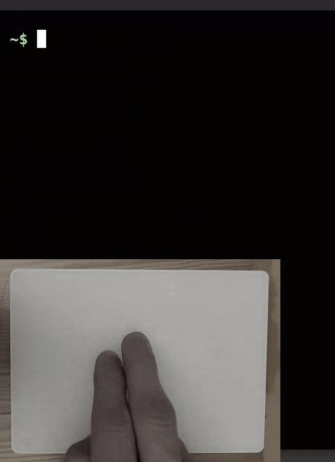
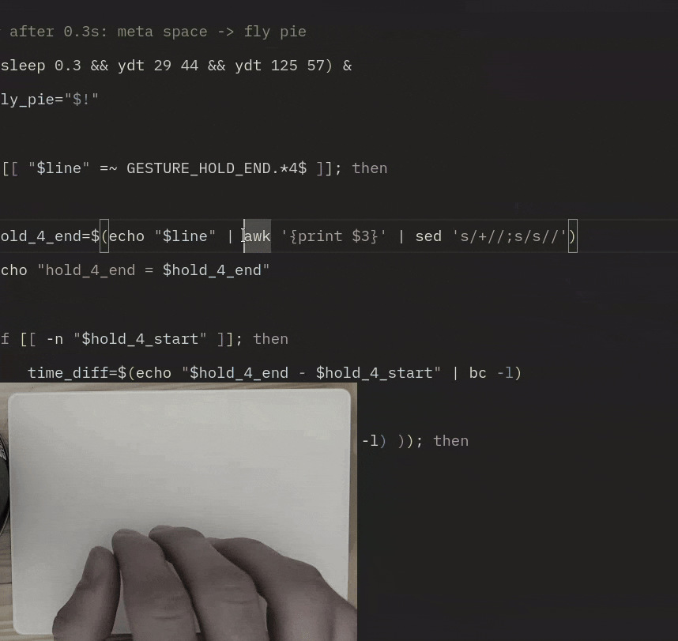
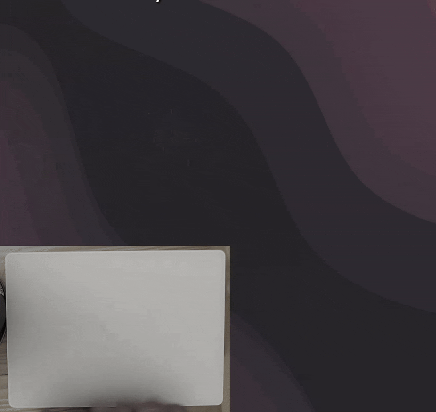

# Touchpad Gestures

A bunch of powerful touchpad gestures for Linux that MacOS users can only dream of, and Windows users can't even imagine.


## Table of Contents

1. **[Features](#features)**
   - [On-screen keyboard](#on-screen-keyboard)
   - [One finger hold](#one-finger-hold)
   - [Two fingers swipe](#two-fingers-swipe)
   - [Three fingers hold](#three-fingers-hold)
   - [Three fingers swipe](#three-fingers-swipe)
   - [Four fingers hold](#four-fingers-hold)
    
2. **[Dependencies](#dependencies)**
   - [Required](#required)
   - [Optional](#optional)
     
3. **[Installation](#installation)**


# Features

## On-screen keyboard

When touching the screen, the on-screen keyboard appears automatically.


## One finger hold

This gesture simulates mouse dragging, as it can sometimes be difficult to do on a touchpad. The mouse's left button is pressed after holding one finger for half a second and is released only after you stop moving the cursor, allowing you to adjust how long the dragging lasts.


## Two fingers swipe

This gesture has different effects depending on the app:

| **Terminal** | **File manager** | 
| ------------------------------------------------------------ | --------------------------------------------------------------- |
| <div align="center">Switching between older and newer commands in the terminal</div> | <div align="center">Navigating between inner and outer directories in a file manager</div> |
|  |  |


## Three fingers hold

This gesture has multiple actions. It is best to combine it with two native functions of **[GNOME Tweaks](https://gitlab.gnome.org/GNOME/gnome-tweaks)**: ***Middle Click Paste*** and ***Click the touchpad with three fingers for middle-click***.

Also, most [clipboard managers](https://github.com/SUPERCILEX/gnome-clipboard-history) have the functionality to copy the text you select with your mouse. This allows you to paste different items on middle click, and others on standard paste (Ctrl+V) which this script emulates with a short hold of three fingers (less than half a second).


Hold between 0.5 s and 1 s to emulate keys: Meta+C - my shortcut for clipboard view.

Hold longer to emulate Meta+comma - my shortcut for resizing a window.


## Three fingers swipe

Swiping with three fingers is used to switch between applications - by emulating Alt+Tab. Depending on how long you swipe, you can switch to different windows.


## Four fingers hold

A short press of four fingers immediately triggers the "Enter" key. It has to be a short hold though, just tapping the touchpad is not enough - due to [libinput](https://wiki.archlinux.org/title/Libinput)'s limitations (otherwise I would change it to a tap for higher convenience).



A longer hold of four fingers (at least 0.3 s) emualtes Meta+Space keys click - my shortcut for activiting the **[Fly Pie](https://extensions.gnome.org/extension/3433/fly-pie/)** menu.



The above menu's configuration can be found in this file: [fly-pie.json](fly-pie.json).


# Dependencies

## Required

This script cannot work without all of these dependencies:

1. **[libinput](https://wiki.archlinux.org/title/Libinput)** - it is the core of this script, used for gesture detection from your touchpad.

2. **[ydotool](https://github.com/ReimuNotMoe/ydotool)** - responsible for emulating key clicks.
It needs to be run with *sudo*, so you will have to add these lines into your **/etc/sudoers** file:
```
ALL ALL=(ALL) NOPASSWD: /usr/bin/ydotool
Defaults env_keep += "YDOTOOL_SOCKET"
```
## Optional

Without these, the script can work but small changes will be needed (described below).

3. **[GNOME Desktop Environment](https://www.gnome.org/)** - the *touch screen* gesture uses ***gsettings*** to activate an on-screen keyboard. If you're not using GNOME, you can probably find a way around it - for example with custom on-screen keyboard apps (but then just make sure to replace ***gsettings*** commands with the proper ones in [run.sh](run.sh)).

4. **[Focused Window D-Bus](https://extensions.gnome.org/extension/5592/focused-window-d-bus/)** - used by the [getwindow.py](getwindow.py) script, which checks the current window name and enables app-specific gestures. I simply do not know another way to do that in Wayland, but I assume there are alternatives for non-GNOME users ([getwindow.py](getwindow.py) will have to be rewritten though).


# Installation

Once you have all the dependencies, make sure to run this command before usage:
```
chmod +x run.sh
```

If you want this script to always run in the background, edit this file: [touchpad-gestures.service](touchpad-gestures.service) to insert the actual path where you will be storing the [run.sh](run.sh) file, into this line:
```
ExecStart=/home/username/bin/touchpad-gestures/run.sh
```
and move [touchpad-gestures.service](touchpad-gestures.service) into this directory:
```
~/.config/systemd/user/
```
finally, run these commands:
```bash
systemctl --user daemon-reload
systemctl --user enable touchpad-gestures.service
systemctl --user start touchpad-gestures.service
systemctl --user status touchpad-gestures.service # this one just to check if it's working
```

Enjoy!
