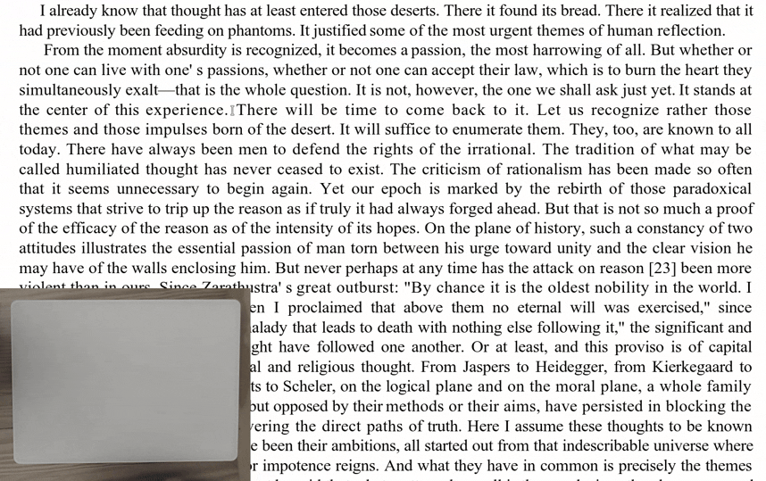
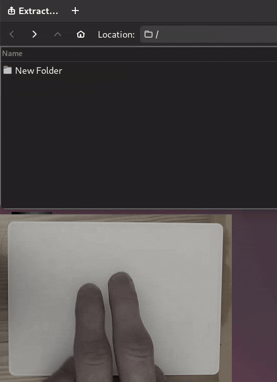

# Touchpad Gestures

A brief description of the project goes here.


## • On-screen keyboard

When touching the screen, the on-screen keyboard appears automatically.


## • One finger hold

This gesture simulates mouse dragging, as it can sometimes be difficult to perform on a touchpad. The mouse's left button is pressed after holding one finger for half a second and is released only after you stop moving the cursor, allowing you to adjust how long the dragging lasts.




## • Two fingers swipe

This gesture has different effects depending on the app:

| **Terminal** | **File manager** | 
| ------------------------------------------------------------ | --------------------------------------------------------------- |
| <div align="center">Switching between older and newer commands in the terminal</div> | <div align="center">Navigating between inner and outer directories in a file manager</div> |
|  |  |


## • Three fingers hold

This gesture has multiple actions. It is best to combine it with two native functions of ****: ***Middle Click Paste*** and ***Click the touchpad with three fingers for middle-click***.

Also, most  have the functionality to copy the text you select with your mouse. This allows you to paste different items on middle click, and others on standard paste (Ctrl+V) which this script emulates with a short hold of three fingers (less than half a seconds).


Hold between 0.5 s and 1 s to emulate keys: Meta+C - my shortcut for clipboard view.

Hold longer to emulate Meta+comma - my shortcut for resizing a window.


## • Three fingers swipe

Swiping with three fingers is used to switch between applications - by emulating Alt+Tab. Depending on how long you swipe, you can switch to different windows.


## • Four fingers hold

A short press of four fingers immediately triggers the "Enter" key. It has to be a short hold though, just tapping the touchpad is not enough - due to 's limitations (otherwise I would change it to a tap for higher convenience).


A longer hold of four fingers (at least 0.3 s) emualtes Meta+Space keys click - my shortcut for activiting the **** menu.


The above menu's configuration can be found in . 


## Installation

1. Once you have all the dependencies, make sure to run this command before usage:
```
chmod +x run.sh
```

2. If you want this script to always run in the background, edit this file:  to insert the actual path where you will be storing the  file, in this line:
```
ExecStart=/home/username/bin/touchpad-gestures/run.sh
```
and move  into this directory:
```
~/.config/systemd/user/default.target.wants
```
and run these commands:
```
systemctl --user daemon-reload
systemctl --user enable touchpad-gestures.service
systemctl --user start touchpad-gestures.service
```
```specific gesture behavior.
